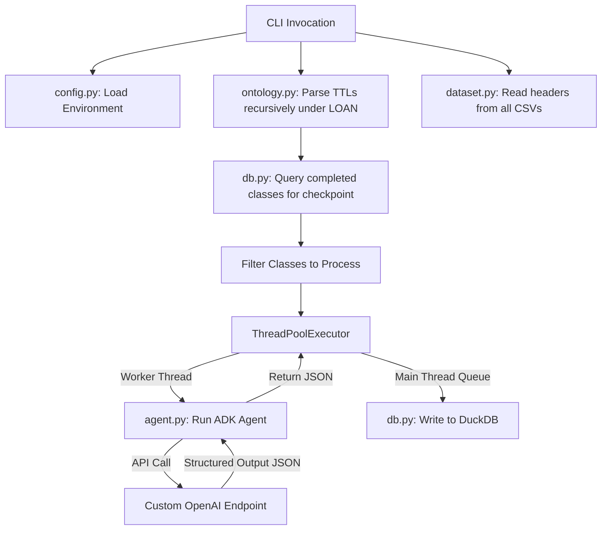

# Google ADK Agent Workflow Engine Blueprint

This blueprint outlines the design, architecture, and schema definitions for the multi-threaded agent workflow engine to be implemented under `app/`.

---

## 1. Architecture Overview

The engine acts as a pipeline that:
1. Identifies the `LOAN` subfolder in the specified ontology folder.
2. Parses all TTL files recursively using RDFLib to extract OWL Classes and their attributes (object/data properties).
3. Reads column headers from all CSV files inside the dataset folder.
4. Initializes a thread pool of worker threads.
5. In each thread, executes a Google ADK Agent (configured for a custom OpenAI-compatible endpoint) to map an OWL Class and its attributes to the dataset columns.
6. Skip classes that have already been mapped (enabling checkpoint/resume support).
7. Serializes the mapping to structured JSON, writes them into a DuckDB database from the main thread, and generates a structured YAML mapping file at the end of the workflow.



---

## 2. Configuration & Environment Variables

All configuration is externalized. A `.env` file should contain the parameters:

```env
# Custom OpenAI compatible endpoint configuration
CUSTOM_LLM_URL=https://api.openai.com/v1   # The target API base URL
CUSTOM_LLM_MODEL=gpt-4o                   # The model name/identifier
CUSTOM_LLM_API_KEY=sk-xxxx...             # Authentication key
```

---

## 3. JSON Output Schema (Pydantic Model)

The agent is configured to enforce structured output matching the following schemas:

```python
from pydantic import BaseModel, Field
from typing import List, Optional

class AttributeMapping(BaseModel):
    attribute_name: str = Field(
        description="The local name or URI of the ontology attribute (property)"
    )
    mapped_columns: List[str] = Field(
        description="The list of dataset columns matching or contributing to this attribute"
    )
    sql_formula: Optional[str] = Field(
        description="DuckDB SQL expression/formula to compute the attribute value from mapped_columns. E.g., 'ApplicantIncome + CoapplicantIncome' or 'log.annual.inc * 12'. Null if 1-to-1 or not applicable."
    )
    not_enough_information: bool = Field(
        description="Flag set to True if there is not enough information in the dataset columns to map to this ontology attribute"
    )
    explanation: Optional[str] = Field(
        description="Detailed explanation justifying the mapping or why there is not enough information"
    )

class ClassMapping(BaseModel):
    class_name: str = Field(description="The local name of the ontology class")
    class_uri: str = Field(description="The full URI of the ontology class")
    source_ttl_file: str = Field(description="The source TTL file containing the class definition")
    attribute_mappings: List[AttributeMapping] = Field(
        description="List of attribute-level mappings for this class"
    )
```

---

## 4. DuckDB Database Schema

To store the results and facilitate checkpoints, we use a single DuckDB database with two tables:

### Table `processed_classes`
Maintains a checkpoint of completed classes to support resuming.
- `class_uri` VARCHAR (PRIMARY KEY)
- `class_name` VARCHAR
- `processed_at` TIMESTAMP

### Table `attribute_mappings`
Stores individual mapped attributes.
- `class_name` VARCHAR
- `class_uri` VARCHAR
- `source_ttl_file` VARCHAR
- `attribute_name` VARCHAR
- `mapped_columns` VARCHAR (serialized as JSON list or comma-separated)
- `sql_formula` VARCHAR
- `not_enough_information` BOOLEAN
- `explanation` VARCHAR
- `created_at` TIMESTAMP

### Table `file_line_sequence`
Stores the generated start and end line ranges for chunking markdown files.
- `filename` VARCHAR
- `start_line_no` INTEGER
- `end_line_no` INTEGER

### Table `text_segments`
Stores logical segments extracted from markdown chunks.
- `segment_id` VARCHAR (PRIMARY KEY)
- `segment_text` VARCHAR
- `filename` VARCHAR
- `segment_start_line_no_global` INTEGER
- `segment_end_line_no_global` INTEGER

### Table `concepts`
Stores reconciled unique concepts and their attributes.
- `concept_type` VARCHAR
- `rationale` VARCHAR
- `concept_name` VARCHAR (PRIMARY KEY)
- `attributes_and_values` VARCHAR (JSON string)
- `summary` VARCHAR

### Table `concept_segment_mapping`
Maps segments to their reconciled concepts.
- `segment_id` VARCHAR
- `concept_name` VARCHAR

---

## 5. File Structure Under `app/`

The codebase is organized modularly under `app/`:

```
app/
├── __init__.py
├── cli.py             # CLI commands (create-data-mapping, generate-report, llm-wiki)
├── config.py          # Environment configuration & ADK initialization
├── ontology.py        # RDFLib recursive TTL parser
├── dataset.py         # CSV column headers reader
├── db.py              # DuckDB reader & writer
├── agent.py           # Google ADK agent setup & mapping execution
├── wiki.py            # PDF conversion, segmentation, classification, reconciliation logic
└── prompt/
    └── mapping_prompt.txt # Externalized prompt template
```
---

## 6. Detailed Module Specifications

### `app/config.py`
- Responsible for loading environment variables and configuring the `google.adk` model settings.
- Initializes a `google.adk.models.lite_llm.LiteLlm` model wrapper configured with the custom OpenAI-compatible endpoint.
- Short function: `get_llm_model()` returning the configured `LiteLlm` model instance, or defaults to the model string `"gemini-3.5-flash"`.

### `app/ontology.py`
- Recursively searches `ontology_folder` to find the directory named `LOAN` (case-insensitive).
- Uses `rdflib.Graph` to parse all `.ttl` files recursively under the `LOAN` folder.
- Extracts `owl:Class` resources and searches for properties related to those classes (e.g. properties appearing in class restrictions, domain definitions, or properties defined in the same namespace).

### `app/dataset.py`
- Finds all `.csv` files inside `dataset_folder`.
- Reads the first row of each CSV to extract column headers and maps columns to their respective source file.

### `app/db.py`
- Manages connection and transactions for DuckDB.
- Handles thread-safe writes: since multiple threads return results to the main thread, the main thread writes sequentially.
- Implements `get_processed_classes(db_path)` and `write_mappings(db_path, mapping_result)`.
- Implements `get_all_mappings(db_path)` to query and structure all saved mappings hierarchically with details (mapped columns, SQL formula, explanation).

### `app/agent.py`
- Reads the external prompt from `app/prompt/mapping_prompt.txt`.
- Sets up the `LlmAgent` with the configured model wrapper and `output_schema` (Pydantic model).
- Runs the agent using `InMemoryRunner` in a unique session per worker task.
- Submits structured mapping requests to the endpoint, parsing and cleaning the structured JSON output from the model's events (`event.content.parts`), and manually calling `validate_schema` to ensure type-safe structured dictionary outputs.
- Sanitizes structured outputs, overriding the source TTL file name with the actual path.

### `app/cli.py`
- Implements Click command: `create-data-mapping`.
- Implements Click command: `generate-report` to generate or regenerate the detailed mapping YAML from an existing DuckDB database.
- Implements Click command: `llm-wiki` to process, segment, classify, and reconcile PDF content to ontology schemas.
- Coordinates CLI arguments for database reading, path relativization, and writing the final detailed YAML report format.
- Implements the multi-threaded orchestration loop via `ThreadPoolExecutor` and uses checkpoints to resume execution.
- Extracts all database mappings at the end of the workflow, relativizes the TTL file paths, and dumps them to the YAML target path.

### `app/wiki.py`
- Recursively scans input directories for PDF files.
- Uses `markitdown` to convert PDFs into markdown files stored in the output directory.
- Chunks markdown files into line ranges with a 10% overlap, storing ranges in `file_line_sequence`.
- Performs LLM-based logical segmentation on chunks, calculating global line boundaries and storing segments in `text_segments`.
- Classifies segments to exactly one ontology concept type using structured `SegmentClassification` schema.
- Dedupes/reconciles new candidates against existing database concepts, performing semantic fuzzy matching and merging attributes/summaries using structured `ConceptMatchDecision`.
- Normalizes concept names according to lowercase/punctuation stripping rules and suffix resolution.
- Validates that all mapped concept references exist.
- Computes and writes a detailed coverage report showing concepts by type and percentage line coverage per file.

---

## 7. FastAPI Backend & Agentic Search API Under `api/`

The API backend is organized modularly under `api/`:

```
api/
├── main.py        # FastAPI app & endpoint setup
├── utils.py       # Summarization (condense_summary) & BM25 ranking (reranking)
├── tools.py       # Retrieval agent tools (doc_context_retrieval & tabular_data_retrieval)
└── workflow.py    # Core workflow orchestrator (Steps 1-6)
```

### `api/main.py`
- Exposes `POST /run` to trigger the search audit.
- Triggers loading of tabular CSV data into DuckDB tables dynamically before starting the search.

### `api/utils.py`
- Implements self-contained BM25 text document selection & reranking.
- Implements recursive chunk summarization using Google ADK LLM Agents to adhere to model context boundaries.

### `api/tools.py`
- Implements document context retrieval agent using query planning, database fetching, segment joins, and summary generation.
- Implements tabular data retrieval agent utilizing query planning, OLAP data cube definition, text generation and self-correcting DuckDB SQL generation, saving result tables to temp CSVs, and executing analytical syntheses.

### `api/workflow.py`
- Co-ordinates the complete 6 steps: Planning, Execution, Analysis, Evaluation, Conditional Branch looping (until confidence >= 90 or iterations count reached), and writing of markdown analysis reports.
