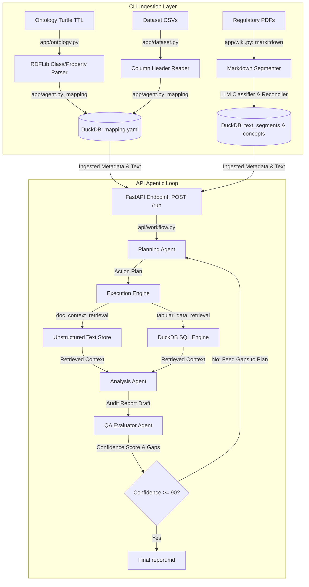

# Bridging the Gap: Blending Structured Data Auditing with Unstructured Policy Intelligence

### How an Agentic Harness Loop Transforms Corporate Compliance from Static QA into Autonomous Risk Research

**Track Selection:** Agents for Business  

---

## Executive Summary

In modern corporate governance, compliance auditing remains a highly siloed, labor-intensive discipline. Risk professionals are forced to manually reconcile unstructured policies (regulatory frameworks, compliance rules, internal operating guidelines) with structured data stored in transaction databases and data warehouses. Traditional search systems, such as basic keyword search or standard Retrieval-Augmented Generation (RAG) Q&A chatbots, fail to bridge this gap because they cannot execute analytical reasoning, synthesize database schemas, or self-critique their findings.

To address this challenge, we developed an autonomous, hybrid **Agentic Insight Engine**. this system combines a batch semantic ingestion pipeline with an iterative, self-correcting planning-execution-evaluation loop. The engine is capable of reading qualitative policies, translating them into quantitative database queries, running analysis, verifying its own work, and outputting structured compliance audit reports.

For example, in my demo use case, the agentic system generated analysis successfully identifies high-risk loan records and maps them to Key Risk Indicators (KRIs) like Public Records, Delinquency, and Default Status. It also provides clear risk classifications and actionable recommendations. 

## 1. The Problem: The Corporate Compliance Silo

Large organizations routinely face complex procedure and policy documents, such as compliance guidelines or financial standards. The information required to conduct these audits is split across two fundamentally different domains:
*   **Unstructured Qualitative Intelligence**: Policy guidelines, regulatory mandates, and internal manuals. These reside as text inside PDFs or corporate wiki pages.
*   **Structured Quantitative Records**: Transaction logs, customer profiles, loan data, and risk metrics. These live in relational tables, data lakes, or databases.

When auditing compliance, human auditors must manually read a policy (e.g., *"Lenders must identify public derogatory records and delinquent credit events"*), translate that rule into database queries, analyze the results, and compile a report. Traditional AI assistants cannot automate this because:
1.  **They lack database awareness**: General LLMs do not know the schema of the database or how business terminology maps to cryptic column names (e.g., matching "delinquent credit event" to a column named `delinq.2yrs`).
2.  **They suffer from single-pass vulnerability**: Standard Text2SQL pipelines generate a single response without validating if the generated query succeeded, if the database returned error codes, or if the retrieved data actually answers the original user goal.  Instead, we implement with the agentic loop for correction and evaluation.
3.  **They cannot perform multi-step planning**: Research and audit analysis require sequential actions—finding the rules first, then querying the database, then analyzing the intersection, and finally critiquing the draft.

## 2. The Solution: Autonomous Risk Research Engine

This project builds a unified agentic platform that acts as an **Autonomous Compliance Auditor**. Instead of answering simple questions, the user provides a high-level auditing objective, such as:

> *"Identify if there are any high risk loan records which violate against the key risk indicators in documentation guidelines."*

The engine coordinates multiple Specialized Agents inside a self-correcting harness. It automatically extracts relevant rules from unstructured documents, maps them to database schemas, generates executable DuckDB SQL queries, performs numerical audit evaluations, and runs an independent QA review. The system continues to replan and query until it achieves a high-confidence compliance evaluation.


## 3. System Architecture

The application is structured into two main layers: an Ingestion Command Line Interface (CLI) and a FastAPI Agentic API layer.



### A. The Ingestion Layer
Before running audits, the system parses the domain's structural and semantic foundations:
1.  **Structured Semantic Mapping**: The pipeline recursively parses OWL Turtle (`.ttl`) files (e.g., in my demo use case, it is Financial Industry Business Ontology - FIBO) using RDFLib. It maps these OWL classes and attributes to dataset tables/columns and then create a mapping that defines how business concepts relate to physical columns.
2.  **Unstructured Document Ingestion**: The pipeline converts regulatory PDFs into Markdown and segments the text. It classifies segments into ontology concept types and reconciles candidates to deduplicate concepts.

### B. The Semantic Translation Layer: Ontologies & YAML Mapping
To make database tables queryable by LLMs without guessing, we use:
*   **Ontology (`.ttl` files)**: Defines domain-specific business terms (e.g., `Loan`, `BorrowerDebtToIncome`, `DerogatoryPublicRecord`).
*   **Semantic Mapping (`mapping.yaml`)**: Maps ontology attributes to database columns (e.g., matching the concept `BorrowerPublicRecordCount` to `pub.rec`). It includes SQL formulas, explanations, and flags highlighting missing information. The LLM Planner and SQL Generator read this file to translate qualitative guidance into exact DuckDB SQL syntax.

### C. The Agentic Audit Layer
The backend system implements the **Agentic Harness Loop** which executes the audit task based on the given objective.

---

## 4. The Agentic Harness Loop

The audit workflow operates as an iterative loop designed to guarantee analytical rigor and correctness:

1.  **Planning**: A Planning Agent parses the high-level user goal alongside the structured semantic map. It outputs a structured `ActionPlan` containing a sequential plan of target queries.
2.  **Execution**: The loop runner triggers specialized tools:
    *   `doc_context_retrieval`: Searches the ingested guidelines in DuckDB using self-contained BM25 text ranking and returns merged text segments.
    *   `tabular_data_retrieval`: Translates business goals to SQL queries using the semantic map. If the SQL fails due to a binder or syntax error, the execution agent intercepts the exception and prompts the model to auto-correct the query, returning the repaired result.
3.  **Analysis**: The Analyst Agent combines the qualitative guidelines with the quantitative query results to draft a detailed compliance audit report.
4.  **Evaluation**: An independent QA Evaluator Agent scores the draft report against the original objective (0 to 100) and lists remaining gaps.
5.  **Loop Routing**: If the evaluator's confidence is $\ge 90$, the loop terminates. If not, the feedback is routed back to the Planner, which compiles a revised, more targeted action plan for the next iteration.
6.  **Report Generation**: The final approved audit report and the execution step trace are written to report.md.

---

## 5. Case Study: Auditing High-Risk Lending Records

The system was evaluated against a LendingClub dataset and public guidelines. The user objective was to identify high-risk loans violating guidelines in the database.  Here is a partial example in the demo.  Quote the summary of the report.md generated by the API call.

### Principal Auditor Risk Assessment: OSFI Residential Mortgage Compliance (report.md)

#### Executive Summary
Per the **OSFI Residential Mortgage Underwriting Practices and Procedures Guideline (2017)**, high-risk status is determined through a **principle-based, dynamic framework** rather than rigid numeric cutoffs. The OSFI framework explicitly mandates:
- **LTV ≤ 65%** for non-conforming mortgages (dynamic recalculations required upon refinancing)
- **DTI/GDS/TDS** limits that are **institution-specific** and must be stress-tested
- **Credit scores** that **cannot be the sole determinant** of creditworthiness
- **No prescribed interest rate caps**

Based on the provided dataset and regulatory context, **no loan records definitively violate OSFI core thresholds** because critical KRI fields (`ltv`, `loan_id`, RMUP stress overlays) are absent, and empirical thresholds (e.g., DTI > 17, FICO < 665) do not align with OSFI's principle-based guidance. However, several records exhibit **elevated risk markers** (`pub_rec > 0`, `not_fully_paid = 1`) that trigger mandatory underwriting overrides and enhanced due diligence per OSFI expectations.

---

#### High-Risk Record Screening & OSFI Alignment

| loan_id | dti  | fico | int_rate | pub_rec | not_fully_paid | purpose           | OSFI Risk Flag | Recommended Action |
|:--------|:-----|:-----|:---------|:--------|:---------------|:------------------|:---------------|:-------------------|
| *N/A*   | 14.47| 687  | 0.1059   | 1       | 1              | all_other         | ⚠️ Moderate    | Manual file review |
| *N/A*   | 2.97 | 712  | 0.0901   | 2       | 1              | small_business    | ⚠️ Moderate    | Verify RMUP stress test |
| *N/A*   | 3.83 | 782  | 0.0901   | 5       | 0              | small_business    | 🟡 Low         | Archive & monitor |
| *N/A*   | 11.28| 692  | 0.1046   | 1       | 1              | all_other         | ⚠️ Moderate    | Enhanced due diligence |
| *N/A*   | 4.00 | 667  | 0.1496   | 0       | 1              | debt_consolidation| 🔴 High (Potential) | Underwriting override log required |


## 6. Integration of ADK Skills & Model Context Protocol (MCP)

To achieve a modular, maintainable, and highly decoupled architecture, the agent execution layer leverages custom **Google ADK Skills** and the **Model Context Protocol (MCP)**:
*   **Modular ADK Skills**: Prompt directives and structural instructions are separated into distinct skill folders under `skills/` containing markdown instructions:
    *   [duckdb-skill/SKILL.md](file:///Users/kahingleung/Downloads/agentic-insight/skills/duckdb-skill/SKILL.md): Guidelines for executing SQL database operations.
    *   [doc-retrieval-skill/SKILL.md](file:///Users/kahingleung/Downloads/agentic-insight/skills/doc-retrieval-skill/SKILL.md): Directives for unstructured policy search, semantic filtering, and recall optimization.
    *   [tabular-retrieval-skill/SKILL.md](file:///Users/kahingleung/Downloads/agentic-insight/skills/tabular-retrieval-skill/SKILL.md): Guidelines for SQL formulation, handling schema configurations, and query repair loops.
    *   [workflow-skill/SKILL.md](file:///Users/kahingleung/Downloads/agentic-insight/skills/workflow-skill/SKILL.md): Standard operating procedures for orchestration, gap identification, and QA evaluation.
*   **Local FastMCP Server**: A standalone database access service is implemented at [duckdb_server.py](file:///Users/kahingleung/Downloads/agentic-insight/mcp/duckdb_server.py) using the FastMCP framework. It exposes specialized tools (such as `list_tables`, `describe_table`, `execute_sql`, `run_sql`, `select_table`) to query raw database tables safely.
*   **Stdio-Based Subprocess Communication**: Instead of opening network sockets or managing persistent database connections, the retrieval client in [api/tools.py](file:///Users/kahingleung/Downloads/agentic-insight/api/tools.py) configures agents to spawn the FastMCP server as an isolated, ephemeral stdio child subprocess for the duration of the agent session. This avoids network footprint, port conflicts, and resource leaks.

---

## 7. Hardened Security Guardrails

The database execution layer implements a multi-layered security model to prevent unauthorized access, database corruption, or arbitrary code execution:
*   **SQL Injection Detection & Prevention**: Before any LLM-generated SQL query is executed, it passes through `check_sql_injection` in [api/utils.py](file:///Users/kahingleung/Downloads/agentic-insight/api/utils.py). This validator strips comments, restricts the AST parsing strictly to a single `SELECT` statement (blocking stacked queries or modifying operations like `DROP`/`UPDATE`), bans system schemas (e.g. `information_schema`), and blocks built-in DuckDB functions that read local files or invoke OS commands (e.g. `read_csv`, `system`, `getenv`, `glob`).
*   **Database Engine Hardening**: Hardening rules are applied directly at the database engine level in [duckdb_server.py](file:///Users/kahingleung/Downloads/agentic-insight/mcp/duckdb_server.py#L65-L70). Immediately upon connecting, the connection executes:
    ```python
    c.execute("SET enable_external_access = false;")
    c.execute("SET lock_configuration = true;")
    ```
    This completely disables the database's ability to read local files, call APIs, or change configurations from raw SQL, even if AST checks are bypassed. Furthermore, retrieval tools load the database in strict read-only mode (`read_only=True`).
*   **MCP Protection & Ephemeral Tokens**: If the MCP server is launched in HTTP/SSE transport modes, it enforces static bearer token authentication (using `MCP_BEARER_TOKEN`). For stdio child subprocesses, the parent process generates a cryptographically secure random token (`EPHEMERAL_MCP_BEARER_TOKEN`) on startup and securely passes it to the child via environment variables, avoiding static secrets storage.

---

## 8. Key Strengths & Conclusion

Our **Agentic Insight Engine** showcases the power of structured-unstructured hybrid analysis. The core strengths of this approach include:
*   **Semantic Data Alignment**: The ontology and `mapping.yaml` allow the agent to understand what database columns mean, translating business terms to database queries.
*   **Iterative Self-Correction**: The tabular retrieval tool automatically detects and repairs runtime SQL database syntax errors.
*   **Rigorous QA Guardrails**: The independent evaluator agent prevents hallucinations by checking the analyst's draft against the original goals. If confidence is low, it loops back to collect more information.

By wrapping structured databases and unstructured policy libraries inside an agentic harness, the system changes corporate compliance from manual, spreadsheet-based auditing into a reliable, autonomous research workflow.
